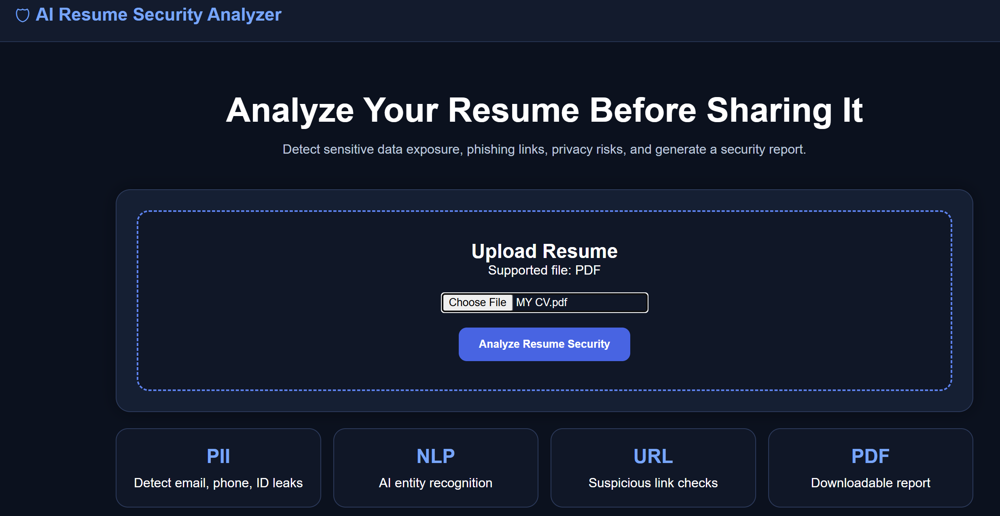
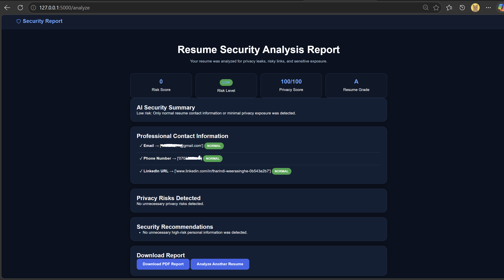

# 🛡️ Resume Privacy Risk Assessment Tool

## Overview

The Resume Privacy Risk Assessment Tool is a cybersecurity-focused web application designed to help users identify unnecessary exposure of sensitive personal information before sharing resumes publicly.

Many job seekers upload resumes to recruitment portals, company websites, and professional networking platforms without realizing that certain details may increase privacy and identity-theft risks. This tool analyzes uploaded resumes, identifies potential privacy concerns, evaluates risk levels, and generates security recommendations.

---

## Key Features

### Resume Analysis

* Upload and analyze PDF resumes.
* Extract text automatically from uploaded documents.

### Privacy Risk Detection

Detects sensitive information such as:

* Passport Numbers
* National Identification Numbers
* Dates of Birth
* Credit Card Information
* Banking Details

### Professional Contact Information Recognition

Identifies standard professional information including:

* Email Addresses
* Phone Numbers
* LinkedIn Profiles
* GitHub Profiles

### AI-Powered Entity Analysis

Uses Natural Language Processing (NLP) to identify:

* Candidate Names
* Organizations
* Locations

### URL Security Analysis

Extracts URLs from resumes and evaluates them for potential security concerns.

### Privacy Assessment

Generates:

* Risk Score
* Risk Level
* Privacy Score
* Resume Grade

### Security Recommendations

Provides actionable recommendations to reduce unnecessary privacy exposure.

### PDF Report Generation

Creates downloadable security assessment reports for users.

---

## Technology Stack

* Python
* Flask
* HTML5
* CSS3
* spaCy NLP
* Regular Expressions (Regex)
* PDFPlumber
* ReportLab
* Git
* GitHub

---

## System Workflow

1. User uploads a PDF resume.
2. Resume text is extracted.
3. Privacy-sensitive information is identified.
4. Professional contact information is recognized.
5. URLs are analyzed.
6. Risk score and privacy score are calculated.
7. Security recommendations are generated.
8. Results are displayed through an interactive dashboard.
9. A PDF report is generated for download.

---

## Project Structure

```text
AI-Resume-Security-Analyzer
│
├── app.py
├── extractor.py
├── pii_detector.py
├── ai_entity_detector.py
├── url_security.py
├── pdf_report.py
├── recommendations.py
├── risk_scorer.py
│
├── templates
│   ├── index.html
│   └── report.html
│
├── static
│   └── style.css
│
├── uploads
│
├── requirements.txt
└── README.md
```

---

## Installation

Clone the repository:

```bash
git clone https://github.com/Tharindi-Weerasinghe/ai-resume-security-analyzer.git
```

Navigate to the project directory:

```bash
cd ai-resume-security-analyzer
```

Create a virtual environment:

```bash
python -m venv venv
```

Activate the virtual environment:

```bash
venv\Scripts\activate
```

Install required dependencies:

```bash
pip install -r requirements.txt
```

Run the application:

```bash
python app.py
```

Open the application in your browser:

```text
http://127.0.0.1:5000
```

---

## 📷 Screenshots

### Home Page



### Analysis Report



## Cybersecurity Concepts Demonstrated

* Privacy Risk Assessment
* Personally Identifiable Information (PII) Detection
* Data Exposure Analysis
* Secure Information Handling
* URL Inspection
* Risk Scoring Methodologies
* Natural Language Processing for Security Applications

---

## Learning Outcomes

Through this project, the following skills were developed:

* Python Application Development
* Flask Web Development
* NLP Integration with spaCy
* PDF Processing
* Security-Oriented Software Design
* Risk Assessment Techniques
* Git and GitHub Version Control
* Frontend Design with HTML and CSS

---

## Future Enhancements

* VirusTotal Integration for URL Reputation Checking
* OCR Support for Image-Based Resumes
* Resume Redaction Suggestions
* Cloud Deployment
* Enhanced Threat Intelligence Features
* Advanced AI-Based Risk Assessment

---

## Author

**Tharindi Weerasinghe**

Cybersecurity Undergraduate
Sri Lanka

---

*Developed as a cybersecurity portfolio project to demonstrate practical skills in privacy analysis, risk assessment, web application development, and secure software design.*
